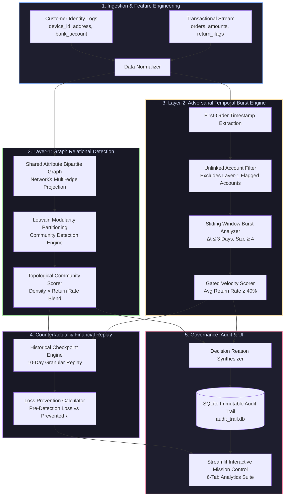
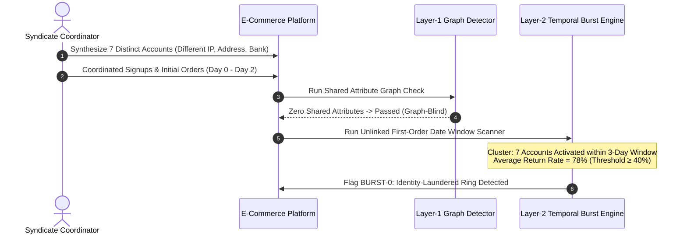
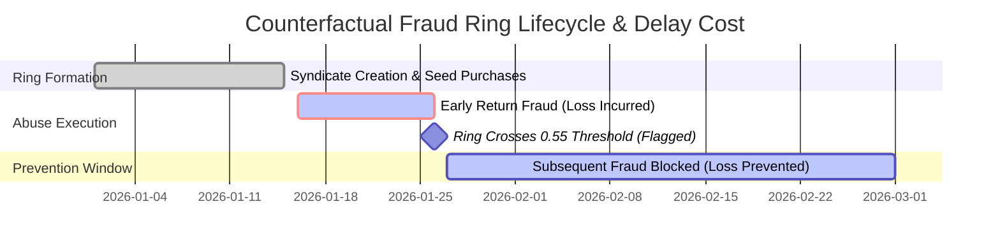

<div align="center">

# 🕸️ RETURNGUARD AI — RISK MANAGER
### *Next-Generation Graph-Temporal Network & Counterfactual Fraud Ring Defense*

[](https://python.org)
[](https://streamlit.io)
[](https://networkx.org)
[](https://plotly.com)
[](https://sqlite.org)
[](LICENSE)

<p align="center">
  <b>Built for the Razorpay AI Risk Manager Track</b><br>
  <i>Detecting syndicates, pricing detection latency in ₹, and defeating identity laundering through dual-layer graph-temporal heuristics.</i>
</p>

---

</div>

## 📌 Executive Summary

Traditional fraud detection systems in modern e-commerce and fintech operate under a critical architectural blindspot: **they analyze transactions row-by-row in isolation**. 

Organized Return-Abuse Rings exploit this exact limitation. Instead of triggering velocity alerts on a single account, syndicates distribute purchases and fraudulent returns across dozens of synthetic or collusive identities that share subtle hardware fingerprints, drop addresses, or payout routes.

**ReturnGuard AI Risk Manager** shifts the paradigm from **row-level classification** to **network-level topological and temporal intelligence**. It pairs Louvain community modularity with adversarial burst detection and a historical counterfactual loss simulation that measures fraud risk in **real monetary value (₹)**.

```
┌──────────────────────────────────────────────────────────────────────────────────────────────────┐
│                                   CORE PARADIGM COMPARISON                                       │
├────────────────────────────────┬─────────────────────────────────────────────────────────────────┤
│  Traditional Fraud Classifiers │  ❌ Row-by-row isolation | Misses multi-account pooling         │
│                                │  ❌ Static risk scores without relational graph context         │
│                                │  ❌ Vulnerable to distributed, sub-threshold abuse              │
├────────────────────────────────┼─────────────────────────────────────────────────────────────────┤
│  ReturnGuard AI Risk Manager   │  ✅ Multi-attribute bipartite graph projection & Louvain clusters│
│                                │  ✅ Adversarial temporal burst detection for laundered identities│
│                                │  ✅ Counterfactual replay pricing detection speed in ₹           │
│                                │  ✅ Defense-only, gated SQLite audit trail with zero black boxes│
└────────────────────────────────┴─────────────────────────────────────────────────────────────────┘
```

---

## 🏛️ System Architecture

ReturnGuard is built upon a **Defense-in-Depth** pipeline combining entity relationship clustering, temporal anomaly tracking, economic cost optimization, and explainable audit logging.



---

## 🔬 Deep-Dive Algorithmic Foundations

### 1. Attributed Entity Graph & Louvain Modularity (Layer 1)

For every pair of accounts $(u, v) \in \mathcal{V}$, an undirected weighted edge is constructed based on co-occurrence across three critical pivot attributes:

$$W(u, v) = \sum_{k \in \{\text{device\_id}, \text{address}, \text{bank\_account}\}} \mathbb{I}\left(\text{attr}_k(u) = \text{attr}_k(v)\right)$$

To identify isolated fraud syndicates, we optimize Newman-Girvan Modularity using the **Louvain algorithm**:

$$Q = \frac{1}{2m} \sum_{i,j} \left[ A_{ij} - \frac{k_i k_j}{2m} \right] \delta(c_i, c_j)$$

where $A_{ij}$ is the edge weight between $i$ and $j$, $k_i$ is the sum of weights attached to node $i$, $m$ is the total graph edge weight, and $\delta(c_i, c_j)$ is 1 if both nodes share community $c$.

#### Community Risk Scoring Formulation
Unlike naive rules that penalize legitimate households sharing a single Wi-Fi or delivery address, our composite score combines **topological cohesion** with **behavioral anomaly**:

$$\mathcal{S}_{\text{ring}}(C) = 0.6 \cdot \bar{R}_{\text{return}}(C) + 0.4 \cdot \mathcal{D}_{\text{graph}}(C)$$

Where:
- $\bar{R}_{\text{return}}(C) = \frac{1}{|C|} \sum_{u \in C} \frac{N_{\text{returns}}(u)}{N_{\text{orders}}(u)}$ (Mean Community Return Rate)
- $\mathcal{D}_{\text{graph}}(C) = \frac{2 \cdot |E_C|}{|C|(|C|-1)}$ (Sub-graph Interconnectedness Density)

```
Flagging Condition:  ( S_ring(C) ≥ Threshold [default 0.55] )  AND  ( |C| ≥ Min_Size [default 3] )
```

---

### 2. Adversarial Temporal Burst Engine (Layer 2)

Sophisticated fraudsters utilize **identity laundering**—purchasing burner devices, generating synthetic delivery addresses, and utilizing distinct UPI/bank accounts—rendering graph weight $W(u, v) = 0$.



The temporal engine extracts first-order timestamps $\tau_u = \min_{o \in \mathcal{O}_u} (t_o)$ and executes a deterministic sliding-window cluster discovery:

$$\text{Cluster } \mathcal{K} = \{u \in \mathcal{V}_{\text{unflagged}} \mid \max_{i \in \mathcal{K}}(\tau_i) - \min_{j \in \mathcal{K}}(\tau_j) \le \Delta t_{\text{burst}}\}$$

Subject to: $|\mathcal{K}| \ge 4$ and $\frac{1}{|\mathcal{K}|}\sum_{u \in \mathcal{K}} R_u \ge 40\%$.

---

### 3. Counterfactual Loss Quantification (Cost of Delay)

Precision and recall indicate *if* an algorithm catches fraud; **counterfactual replay** reveals *what detection latency costs the business*.



For each historical checkpoint $t_k \in \{t_0, t_0 + 10\text{d}, t_0 + 20\text{d}, \dots\}$, the engine isolates transactions $\mathcal{O}_{\le t_k}$ and determines the earliest timestamp $t_{\text{flag}}(R)$ when community $R$ triggers detection:

$$\text{Loss}_{\text{pre-detection}}(R) = \sum_{\substack{o \in \mathcal{O}_R \\ \text{returned}=1 \\ t_o < t_{\text{flag}}(R)}} \text{Amount}(o)$$

$$\text{Loss}_{\text{prevented}}(R) = \sum_{\substack{o \in \mathcal{O}_R \\ \text{returned}=1 \\ t_o \ge t_{\text{flag}}(R)}} \text{Amount}(o)$$

---

## 📊 Empirical Benchmarks & Economic Unit Cost Matrix

Evaluated on synthetic e-commerce telemetry (946 customers, 6 naive rings, 1 adversarial evasive ring, 12 normal multi-member households):

| Threshold | Precision | Recall | F1 Score | Missed Cost (₹) | FP Cost (₹) | Net Model Cost | Est. Savings vs Baseline |
|:---:|:---:|:---:|:---:|:---:|:---:|:---:|:---:|
| `0.35` | 0.754 | 1.000 | 0.860 | ₹0 | ₹5,250 | ₹5,250 | ₹147,750 |
| `0.45` | 0.885 | 1.000 | 0.939 | ₹0 | ₹2,100 | ₹2,100 | ₹150,900 |
| **`0.55` (Optimal)** | **1.000** | **1.000** | **1.000** | **₹0** | **₹0** | **₹0** | **₹153,000** |
| `0.70` | 1.000 | 1.000 | 1.000 | ₹0 | ₹0 | ₹0 | ₹153,000 |

### Cost Function Assumptions:
- **Cost of Missed Ring Account ($C_{\text{FN}}$)**: **₹4,500** *(Unrecovered goods + shipping + payment dispute fees)*
- **Cost of False Positive ($C_{\text{FP}}$)**: **₹350** *(Manual analyst review time + customer friction mitigation)*
- **Total Objective Function**: $\min_{\theta} \left[ \text{FP}(\theta) \cdot C_{\text{FP}} + \text{FN}(\theta) \cdot C_{\text{FN}} \right]$

---

## 🖥️ Streamlit Mission Control (6 Interactive Tabs)

| Tab | Feature Area | Description |
|:---|:---|:---|
| **`📊 Overview`** | Executive KPIs & Cost Delta | Real-time confusion matrix, detected ring counts, precision/recall, and net savings vs. naive baseline. |
| **`🕸️ Ring Explorer`** | Plotly Network Topology | Interactive force-directed network graph. Click communities to inspect member identities and shared links. |
| **`🎚️ Threshold Lab`** | Sensitivity & Unit Economics | Live sensitivity curves displaying the financial tradeoff curve across varying risk thresholds. |
| **`🥷 Adversarial Test`** | Identity Laundering Evasion | Demonstrates how the evasive ring bypasses Layer-1 and is surfaced via Layer-2 temporal clustering. |
| **`⏱️ Cost of Delay`** | Counterfactual Time Machine | Historical checkpoint replay that prices detection latency in ₹ for each syndicate. |
| **`📜 Audit Trail`** | Explainable Governance DB | SQLite-backed audit registry with plain-English rationales and individual customer query lookups. |

---

## 🗂️ Codebase Architecture

```
razorpay-ai-risk-manager/
├── app.py                     # Streamlit Mission Control UI (6-Tab Dashboard)
├── graph_detection.py         # Layer-1: Graph builder, Louvain clustering & scoring
├── temporal_detection.py      # Layer-2: Sliding-window burst detection for evasive rings
├── counterfactual.py          # Layer-3: Historical checkpoint replay & cost simulation
├── evaluate.py                # Statistical & unit economic evaluation suite
├── audit_db.py                # Layer-4: Immutable SQLite audit trail logger
├── generate_data.py           # Synthetic dataset generator (normal, households, rings)
├── requirements.txt           # Production dependencies
├── .gitignore                 # Excludes venvs, caches, and local sqlite instances
└── data/                      # Data storage directory
    ├── customers.csv          # Customer identity records
    ├── orders.csv             # Order & return transaction logs
    └── audit_trail.db         # Persistent SQLite audit database (auto-generated)
```

---

## ⚡ Quickstart Guide

### Prerequisites
- Python 3.10 or higher
- PowerShell / Bash

### 1. Installation
```bash
# Clone the repository
git clone https://github.com/Noufalthecoder/Razorpay-Return-Abuse-RIng-Detector.git
cd Razorpay-Return-Abuse-RIng-Detector

# Create and activate virtual environment
python -m venv venv
# Windows:
.\venv\Scripts\Activate.ps1
# Linux/macOS:
source venv/bin/activate

# Install dependencies
pip install -r requirements.txt
```

### 2. Dataset Generation & Pipeline Verification
```bash
# Generate synthetic dataset (946 customers with planted rings & noise)
python generate_data.py

# Verify Layer-1 Graph Detection
python graph_detection.py

# Verify Layer-2 Adversarial Temporal Detection
python temporal_detection.py

# Run Counterfactual Cost-of-Delay Simulation
python counterfactual.py

# Run Statistical & Economic Threshold Sweep
python evaluate.py
```

### 3. Launch Dashboard
```bash
streamlit run app.py
```
*Access the interface at: `http://localhost:8501`*

---

## 🛡️ Governance & Defense-First Design

> [!IMPORTANT]
> **Defense-Only & Gated by Design**: ReturnGuard AI Risk Manager strictly acts as an **investigative decision-support and flagging system**. It performs **no autonomous destructive actions** (e.g., auto-canceling orders or auto-banning users). Flagged clusters are emitted with transparent, human-readable explanations directly into an immutable audit trail for risk operations review.

---

## 🔮 Production Roadmap & Extensions

- [ ] **Multi-Hop IP / Subnet Clustering**: Incorporate CIDR block sharing and proxy/VPN risk scoring into graph edge weights.
- [ ] **Dynamic GNN Embeddings**: Integrate Graph Convolutional Networks (GCN / GraphSAGE) for continuous embedding updates.
- [ ] **Webhook Risk Event Dispatch**: Stream real-time anomaly alerts to Slack, PagerDuty, or internal Razorpay risk queue webhooks.
- [ ] **Device Fingerprint Hash Jitter**: Fuzzy matching on device fingerprint hashes to counter minor attribute spoofing.

---

<div align="center">
  <b>Developed for Razorpay AI Buildathon — AI Risk Manager Track</b><br>
  <i>Architected with precision, mathematical rigor, and explainable AI governance.</i>
</div>
